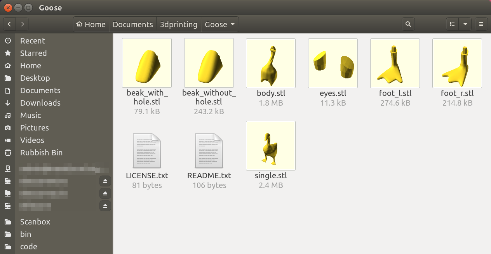

# nautilus-thumbnailer-stl

> Short shell script to convert stl → png via OpenSCAD and associated nautilus thumbnailer config files 

This is a small script to use OpenSCAD to render STL model files to PNG images for the purpose of nautilus thumbnailing, though it can be used standalone too.



_(Above: stl2png in action as a nautilus thumbnailer. STL credit: [Entitled Goose from the Untitled Goose Game](https://www.thingiverse.com/thing:3906053))

## System Requirements
 - OpenSCAD: <https://openscad.org>
 - XFVB: <https://www.x.org/releases/X11R7.6/doc/man/man1/Xvfb.1.xhtml>
 - Optional: Either Oxipng (recommended) OR optipng (alternative)

To install on an apt-based system:

```bash
sudo apt install openscad xfvb oxipng
```

If you'd like to use `optipng` instead of `oxipng`, then replace `oxipng` with `optipng` there - but it's not recommended as `oxipng` is better at optimising PNGs, and is also multithreaded.


## Installation
Installation consists of installing the nautilus thumbnailer and associated script file.

First, clone this git repository:

```bash
git clone https://github.com/sbrl/nautilus-thumbnailer-stl.git
cd nautilus-thumbnailer-stl;
```

Then, run the install script:

```bash
./install.sh
```

The script uses `sudo` to install files to root-owned locations. It will:

 - Install the `stl2png.sh` script as `/usr/local/bin/stl2png`
 - Install config files to enable it as a nautilus thumbnailer
 - Delete the thumbnail cache
 - If nautilus is currently running, ask whether it can kill all open instances thereof.
 - Update the shared MIME info database


## Removal
If you'd like to remove it again, first `cd` to the repository you cloned if necessary:

```bash
cd path/to/nautilus-thumbnailer-stl
```

Then, run the uninstall script:

```bash
./uninstall.sh
```

The script uses `sudo` (just like `install.sh`) to remove files that are in root-owned locations.


## Usage
Follow the above instructions to install and use the nautilus thumbnailer script. If you'd like to use the script standalone, keep reading.

It will be assumed that you've installed stl2png as above. If not, replace `stl2png` with `path/to/stl2png.sh`.

Using the stl2png script standalone is very easy. To convert a given stl file to a PNG image, do something like this:

```bash
std2png path/to/calicat.stl path/to/calicat.png
```

If you'd like to specify the image size, do that like this:

```bash
std2png path/to/calicat.stl path/to/calicat.png 512
```

The image size should be a single positive integer - generated images are always square (for compatibility with OpenSCAD).

If you'd like more flexibility, feel free to read the script itself. It's not really very long, and 90% of it is a nice CLI wrapper around it and associated logic.


## FAQ

### Why use XVFB? The script works fine without it.
It does, but only when called manually. When the nautilus thumbnailer calls it, OpenSCAD crashes when used with the nautilus thumbnailer as it claims it can't open the display.

Note also that xvfb does NOT support any GPU acceleration of ANY KIND as far as I know (open an issue if you're aware of a solution that bypasses this limitation).

Ref [openscad/openscad#3386](https://github.com/openscad/openscad/issues/3368)


## Sources and further reading
 - [OpenSCAD crashes when trying to render STL file on headless system](https://github.com/openscad/openscad/issues/3368)
 - [Oxipng](https://github.com/shssoichiro/oxipng)
 - [Bash yes/no prompt](https://stackoverflow.com/a/29436423/1460422)


## Contributing
Contributions are very welcome - both issues and pull requests! Please mention in your pull request that you release your work under the Apache licence (see below).

If you're feeling that way inclined, the sponsor button at the top of the page (if you're on GitHub) will take you to my [Liberapay profile](https://liberapay.com/sbrl) if you'd like to donate to say an extra thank you :-)


## License
nautilus-thumbnailer-stl is released under the Apache Licence 2.0. The full license text is included in the `LICENSE` file in this repository. Tldr legal have a [great summary](https://tldrlegal.com/license/apache-license-2.0-(apache-2.0)) of the license if you're interested.
